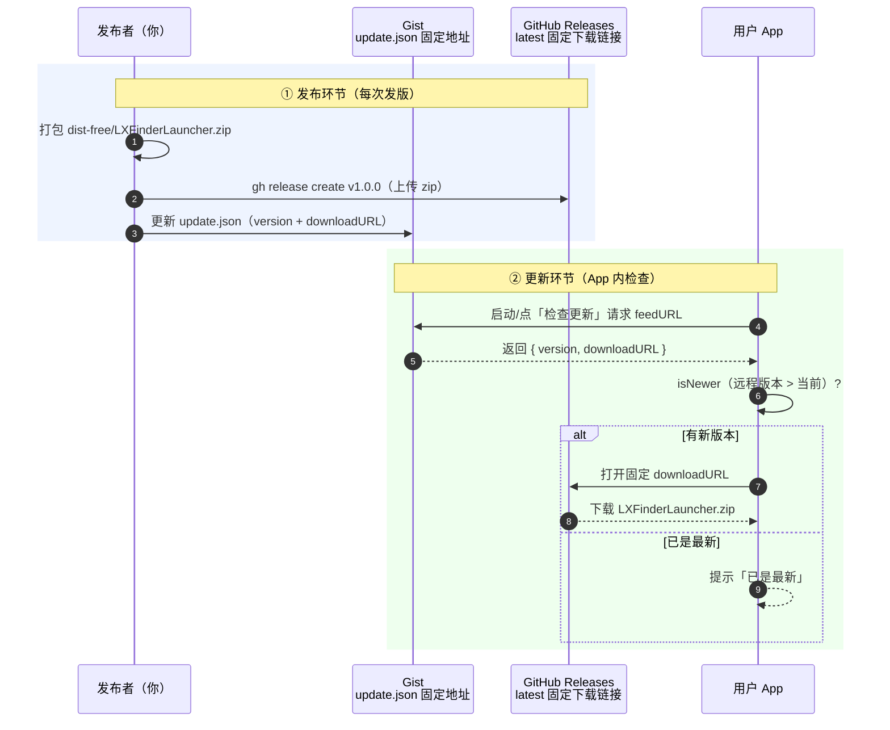
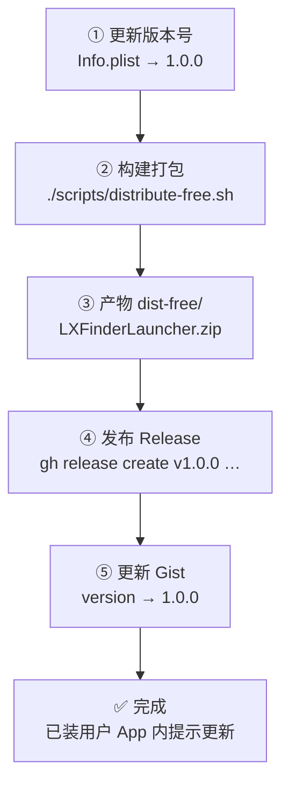

# LXFinderLauncher 发布指南（GitHub Releases）

本文档是把 LXFinderLauncher 构建产物发布到 **GitHub Releases** 供他人下载的完整操作手册，
覆盖两条发布路径、一次性配置、每次发版步骤，以及容易踩坑的注意点。

> 更新机制速览：App 启动/点「检查更新」时，请求一个**固定 URL 的 JSON**（`update.json`），
> 读到 `downloadURL` 后跳转下载。所以发布需要维护两个「永远不变」的地址：
> **JSON 的地址**（Gist Raw 链接）和 **下载包的地址**（GitHub latest 链接）。

## 0. 发布原理一张图

下图展示「发布者发布」与「用户检查更新」两个环节，如何通过 Gist 与 GitHub Releases 打通：



> 核心：Gist 和下载链接都是**固定地址**。Gist 每次发版只改 `version`；下载链接用
> `releases/latest/download/…` 永远指向最新一个 Release 里同名的 zip，所以 JSON 里的下载地址无需改动。

---

## 1. 先选一条发布路径（最重要，先决定）

| | **路径 A · 免费分发** | **路径 B · 签名 + 公证** |
|---|---|---|
| 脚本 | `./scripts/distribute-free.sh` | `./scripts/release.sh` |
| 成本 | **$0**（免费 Apple ID 即可） | **$99/年** Apple Developer Program |
| 产物 | `dist-free/LXFinderLauncher.{app,zip,dmg}` | `dist-release/LXFinderLauncher.dmg` |
| 别人下载体验 | 首次运行被 Gatekeeper 拦截，需右键→打开 或 xattr 命令 | **双击即运行**，完全放行 |
| 适合 | 自己用、好友、学习分享、试水 | 正式对外、期望零门槛安装 |

**推荐**：个人工具先走 **路径 A** 发出去验证需求；等真有用户量、需要"双击即装"的体验再买账号升 B。
两条路径的 **GitHub 发布步骤完全一样**，只有产物文件名和打包方式不同。

---

## 2. 一次性准备（整个项目只做一次）

### 2.1 确认仓库已公开

本工程 remote 已指向 `git@github.com:lucus-products/LXFinderLauncher.git`。
确认 GitHub 仓库是 **Public**（否则别人无法下载 Releases 附件）。

### 2.2 （路径 A）建立发布目录

运行一次 `./scripts/distribute-free.sh` 验证脚本可用，它会生成：

```
dist-free/LXFinderLauncher.app   ← 原始 App
dist-free/LXFinderLauncher.zip   ← 通用压缩包（推荐作为 Release 附件）
dist-free/LXFinderLauncher.dmg   ← 拖拽安装的磁盘映像
```

> 这三个文件**不需要**提交进 git（`dist-free/` 已在 .gitignore）。它们走 GitHub Releases 附件通道分发。

### 2.3 （路径 B）完成签名公证前置条件

`release.sh` 对签名、公证有硬性要求，一次性配置：

1. 注册 Apple Developer Program（$99/年，个人账号即可）；
2. Xcode → Settings → Accounts → 登录付费账号；
3. Xcode → Settings → Accounts → Manage Certificates → 生成 **「Developer ID Application」证书**；
4. 工程 Signing & Capabilities 里把 **Team 切换为付费账号**（Release 才会用 Developer ID 证书签名）；
5. 到 `appleid.apple.com → 登录与安全 → App 专用密码` 生成一个 **App 专用密码**
   （⚠️ 不是你的 Apple ID 登录密码）。

### 2.4 建立 Gist 更新源（App 内"检查更新"功能需要）

1. 打开 `github.com → Gist → New gist`，内容照抄 `docs/update.json.example`：

   ```json
   {
     "version": "1.0.0",
     "downloadURL": "https://github.com/lucus-products/LXFinderLauncher/releases/latest/download/LXFinderLauncher.zip",
     "notes": "更新说明：……"
   }
   ```

2. 点击 **Create public gist**，复制浏览器地址里的 **Gist ID**（URL 末尾那串长哈希）；
3. 修改 `LXFinderLauncher/UpdateChecker.swift` 第 57 行的 `feedURL`，把占位符换成你的：

   ```swift
   // 原来是：https://gist.githubusercontent.com/YOUR_USERNAME/GIST_ID/raw/update.json
   static let feedURL = URL(string: "https://gist.githubusercontent.com/lucus-products/<你的gist-id>/raw/update.json")!
   ```

   > 也可以用 `gh gist create` 建 Gist：`gh gist create docs/update.json.example --public`，输出里带 Gist ID。

> ⚠️ **这是最容易漏的一步**：feedURL 没改，App 里「检查更新」永远连不上源，静默失败或永远显示"已是最新"。
> 发布前务必确认 feedURL 不是 `YOUR_USERNAME`/`GIST_ID` 占位符。

---

## 3. 每次发版流程

每次发版按下面的顺序走一遍（各步骤详见后文小节）：



### 3.1 更新版本号

改 `LXFinderLauncher/Info.plist` 的 `CFBundleShortVersionString`，**版本号要与本次 tag 一致**。

### 3.2 构建产物

**路径 A：**

```bash
./scripts/distribute-free.sh
# → dist-free/LXFinderLauncher.zip
```

**路径 B：**

```bash
APPLE_ID=you@example.com TEAM_ID=XXXXX APP_PASSWORD=xxxx-xxxx-xxxx-xxxx ./scripts/release.sh
# → dist-release/LXFinderLauncher.dmg（已签名 + 公证 + 装订）
```

### 3.3 创建 GitHub Release

**方式一（推荐）：`gh` CLI**

先安装并登录（一次性）：

```bash
brew install gh
gh auth login        # 选择 GitHub.com → HTTPS → 浏览器授权
```

然后发版（两条路径都这么发，只是附件不同）：

```bash
# 路径 A：传 zip
gh release create v1.0.0 dist-free/LXFinderLauncher.zip \
  --repo lucus-products/LXFinderLauncher \
  --title "LXFinderLauncher v1.0.0" \
  --notes "本次更新：……"

# 路径 B：传 dmg
gh release create v1.0.0 dist-release/LXFinderLauncher.dmg \
  --repo lucus-products/LXFinderLauncher \
  --title "LXFinderLauncher v1.0.0" \
  --notes "本次更新：……"
```

**方式二：网页操作**

仓库页面 → 右侧 **Releases → Draft a new release**：

1. Choose a tag → 输入 `v1.0.0` → Create new tag；
2. 填 Title / Release notes；
3. 把 `dist-free/LXFinderLauncher.zip`（或 `dist-release/LXFinderLauncher.dmg`）拖进 **Attach binaries**；
4. Publish release。

> ⚠️ **zip 附件名必须保持 `LXFinderLauncher.zip` 不变**。update.json 的 downloadURL 用的是固定 latest 链接
> `releases/latest/download/LXFinderLauncher.zip`，GitHub 按文件名匹配，改名会导致下载 404。

### 3.4 更新 Gist 的 update.json

1. 打开你的 Gist → Edit；
2. `version` 改成 `1.0.0`（与 tag 一致）；
3. `notes` 写本次更新说明；
4. Update public gist。

> downloadURL **不需要改**——latest 链接永远指向最新版同名附件。

### 3.5 给用户下载入口

README.md 顶部加：

```markdown
## 下载
[⬇️ 下载最新版](https://github.com/lucus-products/LXFinderLauncher/releases/latest/download/LXFinderLauncher.zip)
```

---

## 4. 发版后自检清单

- [ ] 本机双击 `dist-free/LXFinderLauncher.app` 功能正常（先自测再发）；
- [ ] 版本号三处一致：`Info.plist` / GitHub tag `v1.0.0` / Gist 的 `version`；
- [ ] `update.json` 的 downloadURL 里用户名是 `lucus-products`，Gist ID 已替换；
- [ ] Release 附件文件名是 `LXFinderLauncher.zip`（没被浏览器改写成 `LXFinderLauncher(1).zip` 之类）；
- [ ] 命令行验证下载可用：
      `curl -L -o /tmp/test.zip https://github.com/lucus-products/LXFinderLauncher/releases/latest/download/LXFinderLauncher.zip`
- [ ] （路径 B）`codesign -dv --verbose=2 dist-release/LXFinderLauncher.dmg` 里签名是 Developer ID Application，公证已装订。

---

## 5. 注意点汇总（最容易翻车的 10 个坑）

1. **不要传 Debug 产物**。Xcode 26 的 Debug 构建会打 `LXFinderLauncher.debug.dylib`，主二进制只是薄壳，
   发到别人机器不稳定。`distribute-free.sh` 默认 Release 已是单二进制，别手滑传 dist-build/Debug 下的 app。
2. **zip 文件名被浏览器改写**。Chrome 下载带空格/中文名的附件可能加 `(1)`，务必传原名、保持名不变。
3. **feedURL 占位符没改**。这是「检查更新」失效的头号原因，见 2.4。
4. **Gist 不要设成 secret**。secret gist 的 raw 链接仍可访问，但换账号就失效，且不便协作，用 public。
5. **版本号对不上**。tag 是 `v1.0.0`、JSON 是 `1.0.0`（不带 v）、Info.plist 三处必须同一数字，
   App 用 `isNewer` 比较，版本落后不会提示。
6. **App 专用密码 ≠ 登录密码**（路径 B）。填错 notarytool 直接鉴权失败。
7. **签名不是 Developer ID Application**（路径 B）。`release.sh` 会先校验，报错就回 Xcode 把 Team 切付费账号。
8. **DMG 没做公证装订**（路径 B）。只签名不公证，Gatekeeper 仍会拦；release.sh 已自动做，
   但手动改产物时别跳过 `stapler staple`。
9. **国内下载慢**。套代理：`https://ghproxy.com/https://github.com/...`，或改用阿里云 OSS / 腾讯 COS 托管 zip 和 update.json（URL 依旧固定，无需改代码）。
10. **自动化授权被误拒**。首次运行若误点拒绝，用户侧重置命令：
    `tccutil reset AppleEvents com.linx.LXFinderLauncher`

---

## 6. 常见问题（FAQ）

**Q：别人下载后双击打不开 / 提示"已损坏"？**
路径 A 未签名，属预期。让对方二选一：
- 右键 `LXFinderLauncher.app` → 打开（多一次确认）；
- 终端执行 `xattr -dr com.apple.quarantine '/path/to/LXFinderLauncher.app'`。

正式对外就上路径 B。

**Q：发了一版新功能，用户检查更新却显示"已是最新"？**
按 4 自检清单逐项排查：feedURL 是否占位符、Gist version 是否真的改到了、json 是否合法（可先 `curl` raw 链接看内容）。

**Q：update.json 每次都改 version，下载地址会不会过期？**
不会。downloadURL 用的是 `releases/latest/download/…` 固定 latest 链接，只要每次上传同名 zip，永远指向最新版。

**Q：用 gh 发版时报 "tag already exists"？**
说明 tag 已存在（上次失败残留）。删掉重来：`git push origin :refs/tags/v1.0.0 && gh release delete v1.0.0 --yes`。

**Q：Xcode 工程改了代码，怎么出下一版？**
重跑 3.2 构建脚本即可（脚本产物路径固定，覆盖旧文件）。版本号记得 +1 再发。

---

## 7. 相关文件

| 文件 | 作用 |
|---|---|
| `distribute-free.sh` | 路径 A 打包脚本（$0） |
| `release.sh` | 路径 B 签名+公证+装订+DMG 脚本（$99/年） |
| `build.sh` | 纯构建脚本 |
| `docs/update.json.example` | 更新源 JSON 模板 |
| `LXFinderLauncher/UpdateChecker.swift` | App 内更新检查逻辑，`feedURL` 需改成本机 Gist |
| `.gitignore` | 已忽略 `dist-build/` `dist-free/` 等产物目录 |
